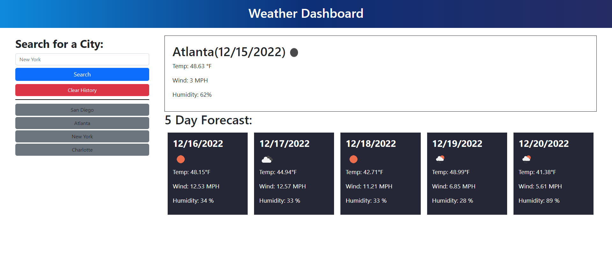

  # Weather Dashboard

  
  ## Description

  This project was made under the constraints of requiring the API from openweathermap, and creating a working example of a search feature, as well as local storage.  The contents do include the usage of the moment.js library as well, to give the date and time.  This project served as a purpose to learn about server side APIs and how they work.  
  
---
  ## Table of Contents

  * [Installation](#installation)
  * [Usage](#usage)
  * [License](#license)
  * [Contribution](#contribution)
  * [Tests](#tests)
  * [Questions](#questions)
---
  ## [Installation](#table-of-contents)

  This is a web-based application, so you only need to access the website at: 
  [Weather Dashboard](https://areed98.github.io/weather-dashboard)

---
  ## [Usage](#table-of-contents)

  To use the application, please follow the link above, and then type in your search bar the city you would like to check the weather for, and click search.  If you would like to search for a previous city, just click the city name in the dropdown list, and to clear the list, use the Clear history button.
  

---
  ## [License](#table-of-contents)

  The application is covered under the following license:

  [MIT](https://choosealicense.com/licenses/MIT)

---
  ## [Contribution](#table-of-contents)

  Please contact me via github if you would like to contribute.

---
  ## [Tests](#table-of-contents)

  To test the application, you can clone this repo using: ```git@github.com:areed98/weather-dashboard.git``` and then change any variables you would like.

---
  ## [Questions](#table-of-contents)

  Please use the following links for contact:

  [GitHub](https://github.com/areed98)

  [Email: austinjreed89@gmail.com](mailto:austinjreed89@gmail.com)